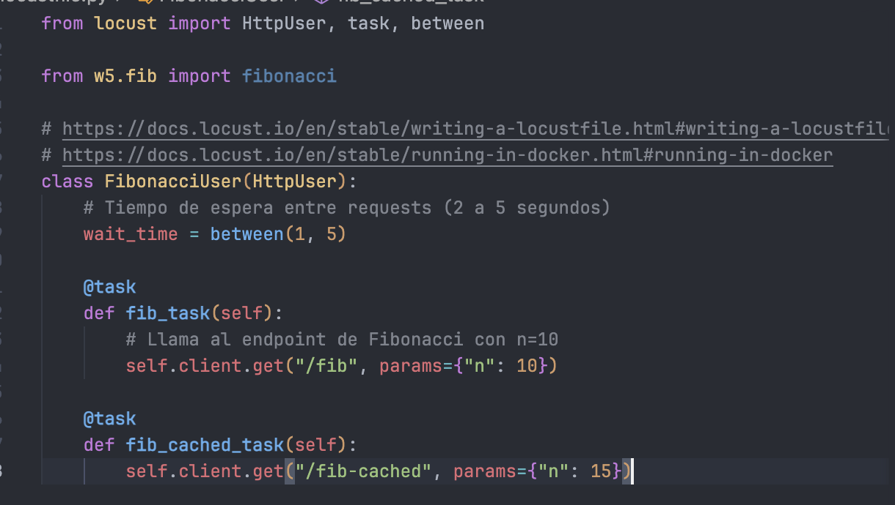
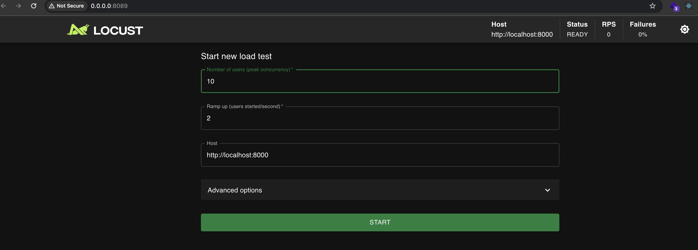
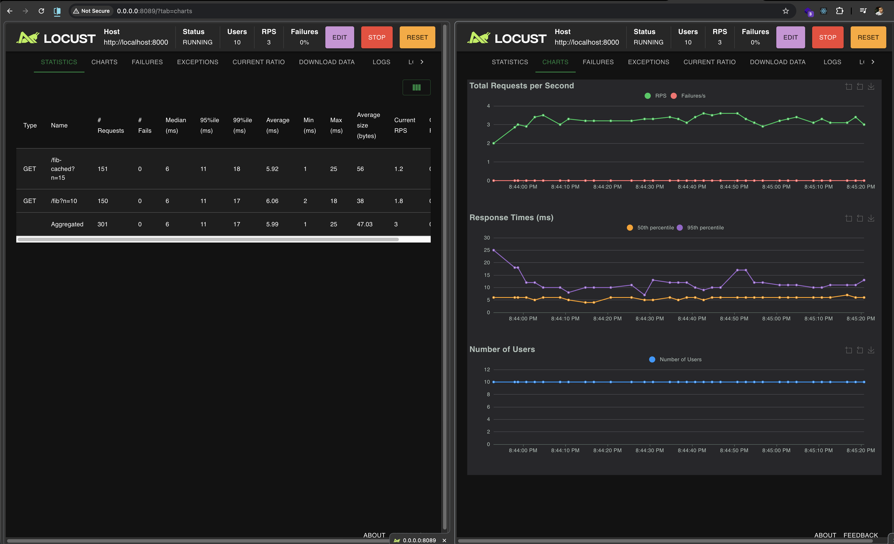
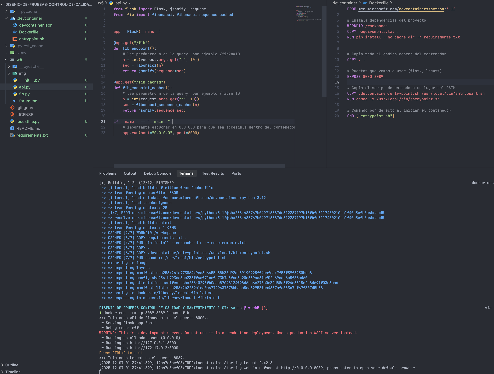

### 3. Simulación de una API Fibonacci con Locust

Se configuró un entorno en Docker que levanta una pequeña API en Flask y Locust para simular carga sobre dos endpoints de Fibonacci:

- `GET /fib?n=10`
  - Calcula la secuencia de Fibonacci de longitud 10 usando una implementación iterativa.
- `GET /fib-cached?n=15`
  - Calcula la secuencia de Fibonacci de longitud 15 usando una versión **memoizada** con `@lru_cache` (programación dinámica).

#### Configuración de la prueba de carga

En la interfaz de Locust se configuró:

- **Número de usuarios (peak concurrency)**: `10`
- **Ramp up (users started/second)**: `2` usuarios por segundo

Esto significa que Locust va creando 2 usuarios virtuales por segundo hasta llegar a los 10 usuarios concurrentes, cada uno haciendo peticiones repetidas a los endpoints configurados en `locustfile.py`.

#### Resultados observados

De acuerdo con las métricas de Locust:

- La API **cacheada** (`/fib-cached?n=15`) es **ligeramente más eficiente en promedio** (menor tiempo medio de respuesta).
- Sin embargo, para los valores de `n` usados en la prueba (10 y 15), la diferencia es **mínima**.
- Ambas APIs:
  - Mantienen tiempos de respuesta muy bajos (del orden de milisegundos).
  - No presentan **fallos**, **errores HTTP**, ni **excepciones** bajo la carga configurada.

En resumen, tanto la versión normal (`/fib`) como la versión memoizada (`/fib-cached`) son **perfectamente utilizables bajo esta carga**, y la versión cacheada empieza a mostrar sus ventajas cuando el tamaño del cálculo crece o la carga de usuarios aumenta.

#### Evidencias (capturas)

Configuración y código:

Inicio de la UI de Locust:

Ejecución de la prueba y métricas:

Ejecución en Docker (API + Locust):

